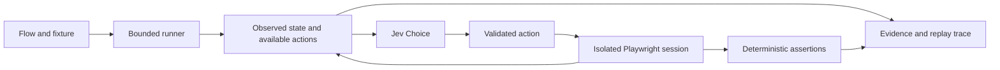

# Project guide

## Scope and design

The project is named **JevTest**. Its selected primary domain is **JevTest.dev** (`jevtest.dev`). The package and CLI use `jevtest`; the default configuration file is `jevtest.config.ts`.

The [Notion specification](https://app.notion.com/p/3de9a6efcd588026a01fcc84e6941433) defines an exploratory testing tool, with a future hosted offering mentioned separately. This delivery implements a local CLI/library. It does not register domains, create a hosted dashboard, or publish a package.

The root package follows the template's separation of source, configuration, tests, documentation, and GitHub automation. Monorepo orchestration, application scaffolds, databases, authentication foundations, and CorieW dependencies are omitted.



The action graph records observed transitions. It is not the correctness specification: a missing checkout control is detected by an independent assertion even though discovery cannot offer it as an action.

## Integration contracts

`Flow` carries an ID, goal, starting URL, fixture data, and human-readable success criteria. The strings describe requirements to Jev; executable `check` assertions enforce them.

`Adapter.open(flow, runId)` returns one disposable `Session`. A session observes the application, executes one predefined typed action, evaluates checks, captures evidence, and closes. Non-browser applications can implement this interface directly. Custom session methods must stop their own outstanding work on close; a JavaScript promise cannot forcibly terminate arbitrary integration code.

`createBrowserAdapter` implements this contract with Chromium. It fixes viewport, locale, and timezone, blocks service workers and downloads, and restricts requests to the starting origin plus configured `allowedOrigins`. Add required CDN/API origins explicitly. New popup pages are closed; multi-tab flows require a custom adapter.

Use `setup(page, flow, runId)` to create isolated application data and establish authentication before navigation. Use `cleanup(flow, runId)` to remove only that run's fixture data. If data lives in an external service, namespace it with the run ID. Discovery resets frequently; its setup must be repeatable. Replay uses a fresh run ID but the same fixture values.

Use `ready(page)` to wait for a reliable application-specific condition after navigation and actions. The adapter does not assume `networkidle` means ready. A pending fetch can otherwise produce a premature snapshot. Assertions should query authoritative data through `check`; `readData` adds relevant application data to model context and state fingerprints.

`check` returns:

```ts
{
  complete: confirmationVisible,
  invariants: [{ name: 'No duplicate orders', passed: orderCount <= 1 }],
  assertions: [
    { name: 'Exactly one order', passed: orderCount === 1, actual: orderCount },
    { name: 'Correct total', passed: actualTotal === checkoutTotal },
  ],
}
```

Invariants run at every observed state. Success assertions are evaluated as pass/fail requirements only once `complete` is true; otherwise an unfinished checkout would be reported as a failure too early. Completion with no assertions is a configuration error. Exact assertions remain authoritative if a subsequent model assessment is unavailable.

## Actions and state

Supply `actions(page, flow)` for an explicit application model, or use DOM discovery. Discovery enumerates visible, enabled buttons, links, inputs, textareas, selects, and elements with `role=button`. It prefers test IDs and element IDs, with a structural CSS path fallback. Dynamic DOMs should use explicit stable selectors. Each execution requires a selector matching exactly one element.

Text and select inputs use **only** values supplied in `inputFixtures`, keyed by selector. Password/file/hidden inputs are not automatically offered. Checkbox and radio discovery offers the checked state; explicit actions can offer unchecked variants. Jev cannot invent values or execute code. Custom actions require a custom adapter.

Action IDs must be unique within a state and cannot be `__abort__`, which is reserved for the always-available abort option. The default browser action cap is 40. Discovery returns the first 40 sorted actions; explicit action spaces exceeding the limit are rejected.

Fingerprints include URL, up to 8,000 characters of visible text, form controls, application data, and available actions. Error/network history is excluded from the hash. Same-URL states with different cart data remain distinct. Large pages can collide at the semantic level if all differences fall outside captured data; use `readData` and explicit actions for important state. `normalize` can remove irrelevant timestamps or random IDs, but must retain business state needed to distinguish bugs.

## Jev judgments

The integration uses the documented [TypeSafe HTTP API](https://docs.typesafe.ai/api), [Choice primitive](https://docs.typesafe.ai/primitives/choice), and [bounded function selection pattern](https://docs.typesafe.ai/cookbooks/function_calling). The default model is `jev-latest`; pin `TYPESAFE_MODEL` when comparing runs over time.

Selection chooses among available action IDs plus abort using the public flow, current observation, and recent transition history. History includes action labels and before/after state identities so repeated routes remain visible. The selector never receives assertion results or fixture fault labels.

Assessment receives public requirements, observed before/after state, and domain-independent numeric/record differences. Each requirement sentence is judged separately; up to eight question groups run together in one request, with remaining requirements preserved in the last group. Prefer short, explicit `successCriteria` entries. Differences are evidence, not automatic bug rules: an added record or changed balance can be correct.

A separate request verifies candidate findings without receiving the first answers. It also revisits uncertain requirements when no further actions are available. Conflicting judgments or failed verification remain uncertain. This is the same model with a focused evidence prompt, not an independent-model guarantee. Selection, initial assessment, and optional verification use at most three logical requests per action, before bounded transient retries. Application actions execute only once.

The assessment confidence threshold defaults to 0.6 and is configurable. It is a starting policy, not a calibrated guarantee. A strong initial finding survives verification when the second answer also chooses `unexpected` with at least 0.5 probability; it need not independently clear the original confidence threshold again. Two low-confidence answers do not become a confident finding. Traces preserve final `checks`, `initialChecks`, and raw `verificationChecks`, including disagreements and verification errors. One supported requirement violation is enough for a candidate finding; passing checks do not average it away. Top-level confidence/probabilities describe the deciding check, not a calibrated probability for the whole flow. Selection confidence is recorded but does not override deterministic action availability.

## API budgets

All parallel flows share a `TokenBudget`. Admission reserves `4 × UTF-8 request bytes + 4,096` tokens before a request starts. Successful responses replace that reservation with provider-reported input/output tokens. Failed or malformed responses keep the full charge because their usage is unknown. Payloads over 24,000 bytes are rejected before sending. Each retry and verification request requires new budget admission.

`JevPolicy` retries transient HTTP 429/500/502/503/504/529 responses once by default. Set `retries: 0` to disable retries, or up to `2`; `retryDelayMs` defaults to 250 ms with exponential delay. Authentication errors, invalid answers, caller cancellation, and budget failures are not retried. These retries repeat model inference, never browser mutations.

This is conservative accounting, **not a tokenizer proof or a server-enforced billing cap**: the API does not expose a hard per-request output-token limit. Actual usage can only be confirmed after the response. A response above its reservation stops further requests. In-flight requests may already have been admitted. Keep substantial headroom below any account spending ceiling. The shop pilot used a 250,000-token ceiling; the later benchmark experiments use a persistent cumulative ledger. See [measured improvements and spending](improvements.md).

`usage.requests` counts attempted requests, `inputTokens` and `outputTokens` are reported usage, `chargedTokens` includes unknown-usage reservations, and `reservedTokens` tracks active requests. Requests and flow operations have separate timeouts. API credentials are read from environment variables or supplied to `JevPolicy`; credentials are never serialized as configuration.

## Evidence and replay

Runs persist a versioned JSON trace with starting conditions, actions, snapshots, assertions, classifications, and relative evidence filenames. Reports include both model candidates and deterministic failures. State graphs export as JSON and Graphviz DOT. The self-contained HTML report escapes application content and requires no external scripts.

Replay opens a fresh fixture, verifies the initial fingerprint and checks, then executes the exact recorded action definitions. It checks before/after fingerprints and deterministic assertions at every step. A changed selector, input, state, or assertion produces divergence. Model classifications are not rerun, so replay confirms observed behavior, not the truth of a model's interpretation. Incomplete traces may reproduce their recorded prefix; they remain incomplete source runs.

Run, replay, and discovery cleanup default to 15 seconds. Set `limits.cleanupTimeoutMs` in a project or pass the corresponding replay/crawl option to change that allowance. Concurrent close calls share one cleanup promise. Cleanup timeouts remain recorded failures; increasing the allowance does not convert state divergence into a successful replay.

The crawler uses breadth-first reset-and-replay traversal across configured entry contexts, with shared depth, state, edge, and wall-clock limits. `crawl({ adapter, flows })` explores multiple contexts; `flow` remains supported for a single context. Discovery ignores success checks, makes no model calls, and does not certify requirements. Results include `complete`, entry-context counts, and `frontier`: available actions whose destinations have not been explored. Failed actions remain in that list. Completeness covers only the reachable states exposed by the configured adapter, inputs, and fixtures.

`jevtest discover --config jevtest/config.ts --output artifacts/run` explores every configured flow context and writes `action-space.json`, `graph.json`, and `graph.dot`. Use `--flow id` to restrict the starting context. CLI defaults are depth 5, 500 states, 1,000 transitions, and 60 seconds; override them with `--max-depth`, `--max-states`, `--max-edges`, and `--discovery-timeout` (milliseconds). The library defaults remain 50 states and 100 transitions. Incomplete discovery exits with code 1 while preserving its partial map. Later test runs preserve `action-space.json` and write their observed graph separately.

WebViewer overlays recorded flow paths on the saved application map using exact state fingerprints and action definitions. Flow views retain the full map and layout, highlight only that flow's route, and show repeated transition step numbers. Missing discovery data, unresolved actions, and states not matched to the discovery map remain explicit. Matching requires consistent fixtures and state normalization between discovery and runs.

## Data handling and operating constraints

Run against controlled test systems with permission to exercise their actions. Discovered clicks can submit forms and change application data. Use an explicit action space for destructive or privileged interfaces.

Artifacts can contain application data. The adapter masks input fields and `[data-sensitive]` screenshot regions, redacts TypeSafe-style keys and bearer tokens in JSON/text, and omits network headers and bodies. These measures are not general PII detection. Use synthetic fixtures, narrow `readData`, and a custom `normalize` or adapter for domain-specific redaction. Review evidence before sharing it. HTML snapshots omit script elements and input values but remain diagnostic snapshots, not a reconstructed live application.

The adapter currently targets one main document; it does not automatically model iframes, multi-tab workflows, uploads, drag/drop, arbitrary keyboard gestures, mobile emulation, or virtualized content beyond the observed DOM. These can be added through custom adapters or explicit integration code. Hosted infrastructure, automatic fixture generation, and a Shortest comparison are future work; the included benchmark compares Jev with a deterministic traversal baseline on a small controlled fixture.

## Development

The public repository is `CorieW/JevTest`. `main` is the default stable branch; `next` is the integration branch. Open feature, fix, and dependency-update PRs against `next`. Promote releases through a PR from this repository's `next` to `main`; `Verify` rejects other sources for `main`.

Both branches require a reviewed PR, fresh approval after changes, approval of the latest push, resolved review threads, code-owner approval, and an up-to-date successful `Verify` check from GitHub Actions. Deletion and force pushes are blocked. Administrators retain bypass access only through PRs, not direct pushes. The template requires code-owner review only on `main` and allows administrator bypass at all times; JevTest tightens these two settings for its public repository.

Public-repository safeguards include SHA-pinned CI actions, read-only workflow tokens, disabled workflow PR approval, maintainer approval for every external contributor's fork workflows, secret scanning/push protection, and private vulnerability reporting. CI never uses the live TypeSafe API key. `pnpm secrets:check` detects common key formats without printing matched values. Generated artifacts and local environment files are ignored.

`pnpm verify` runs formatting, lint, strict type checks, offline tests, and the distributable build. Chromium tests cover the real fixture shop. GitHub Actions installs Chromium and runs the same checks. Use Conventional Commits and a `## Changes` section in PR descriptions. Keep credentials and evidence out of commits. Licensing remains pending; do not publish until terms are adopted.
