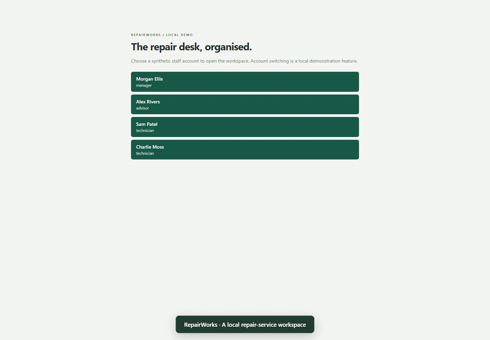

# RepairWorks

[](media/demo.webm)

[Watch the demo](media/demo.webm) — device intake, quotes, repairs, invoicing, payments, and the workshop workspace.

A repair-service workspace with two locations, three staff roles, persistent records, and deliberate business defects of varying severity. Its JevTest integration covers recording a payment and retrying the same receipt. It remains separate from the 720-flow benchmark registry.

## Run

From the repository root:

```sh
pnpm install
pnpm exec tsx examples/repairworks/src/serve.ts
```

Open **http://127.0.0.1:4330** and choose a demo staff account. The application binds to loopback only. It uses synthetic data and local account switching instead of production authentication; no external services, email, payments, or model APIs are called.

`REPAIRWORKS_PORT` changes the port. `REPAIRWORKS_DATA` selects a JSON data file; the default is ignored `artifacts/repairworks/database.json`. Data survives restarts. For a fresh workspace, stop the server and choose a new data file. Run only one server per data file.

## Workspace

- **Overview:** work due, approval queue, outstanding balances, and replenishment alerts.
- **Work orders:** intake, search and filters, priority, due dates, technician assignment, editable quotes, approval, repair, completion, cancellation, and notes.
- **Customers:** contact records, duplicate-email validation, and archive restrictions.
- **Inventory:** twelve part types with separate on-hand and reserved quantities at Central and Riverside.
- **Purchasing:** supplier orders, partial deliveries, delivery references, and receiving history.
- **Invoices:** quote-derived totals, VAT, discounts, partial payments, refunds, and outstanding balances.
- **Team and activity:** staff roles, availability, workload, and a durable audit log.

The starting workspace contains 12 customers, 5 staff accounts, 12 parts, 24 work orders across six lifecycle states, 4 invoices, and 2 purchase orders. Forms use server-side validation, session-bound CSRF tokens, revision checks, and serialized writes. No browser storage reset is needed between page visits; all accounts share the same local workshop data.

## Business requirements

Quotes require customer approval before parts are reserved. Reservations must not exceed available stock, including when a part appears on multiple quote lines. Starting a repair consumes parts at the work order's location. Cancelling a started repair must not automatically return installed or discarded parts to saleable stock.

Only active technicians can receive new assignments. Archived customers retain their history but cannot receive new work orders. Managers control discounts, refunds, supplier orders, and customer archiving. Advisors handle intake, quotes, assignment, cancellation, invoices, payments, and delivery receipts. Technicians work on their assigned repairs and add notes.

One completed repair can have one invoice. Amounts use integer pennies and 20% VAT. Payment and delivery references identify one business event and must not be processed twice. Cumulative refunds cannot exceed collected payments. Stock alerts include quantities at or below the reorder point. Search should ignore letter case, and priority sorting should put urgent work first.

## Source and validation

`src/` contains the domain model, seed data, persistence, business services, HTTP host, and server-rendered UI. It has no dependency on JevTest or the benchmark harness. JevTest configuration and flow definitions live separately in `jevtest/`. Ordinary application checks live in [test/repairworks.test.ts](../../test/repairworks.test.ts); integration and replay checks live in [test/repairworks-project.test.ts](../../test/repairworks-project.test.ts).

## JevTest payment checks

```sh
pnpm dev run --config examples/repairworks/jevtest/config.ts --policy baseline --output artifacts/repairworks-checks
```

Each flow starts its own seeded database and loopback server on port 4334 (`JEVTEST_PORT` overrides the port), signs in as the demo manager, and closes the server afterward. Runs are sequential. Exact checks read persisted records and verify the receipt count, amount, balance, invoice prices, refunds, and unrelated data. The action space is limited to the payment form.

The two-flow offline check produced **one pass and one intentional failure**: retrying a £10 receipt records two payments totalling £20. Both traces reproduced against fresh data. Exit code 1 reports that assertion failure. These results cover the two payment tasks only; they do not measure live Jev accuracy or coverage of the other deliberate defects. No model API calls were made.

For maintainers preparing a later evaluation, the separate [defect catalogue](../../docs/repairworks-defects.md) lists 12 deliberate problems with reproduction steps. Keep that catalogue out of an evaluator's decision context.
