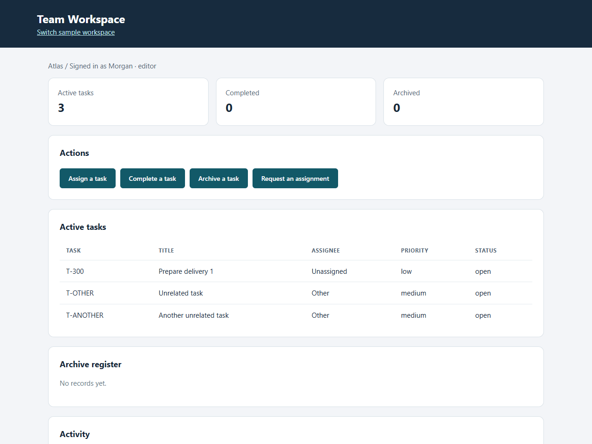

# Team task board

[](media/demo.webm)

[Watch the demo](media/demo.webm) — task assignment, completion, archiving, and activity history.

A project task service with assignments, completion, archiving, activity history, and viewer/editor permissions. It keeps a target task and two unrelated tasks so tests can detect collateral edits as well as the intended change.

**240 user flows:** four workflows × 30 fixture combinations × healthy/faulty versions. The 120 matched task pairs vary project, task ID, title, assignee, and priority. Users choose a task from the project records and fill the relevant teammate or operation form before reviewing and saving.

| Workflow               | Healthy / faulty | Deliberate faults                                 |
| ---------------------- | ---------------- | ------------------------------------------------- |
| Assign                 | 30 / 30          | Wrong assignee; priority reset                    |
| Complete               | 30 / 30          | Duplicate activity; stale completed count         |
| Archive                | 30 / 30          | Deletion instead of archival; wrong task archived |
| Reject viewer mutation | 30 / 30          | Permission bypass; a write despite denial         |

Each fault appears in 15 cases. Permission tests deliberately submit unauthorized requests; correct denial without a write is a passing result. Checks cover the persisted record and activity, so a reassuring UI message alone cannot pass.

Run manually: `pnpm benchmark:serve taskboard`, then open `http://127.0.0.1:4320`. Run without API access: `pnpm benchmark --app taskboard --mode reference`. The [shared harness](../../test/benchmarks/) supplies session isolation, browser execution, replay, and scoring.

Fault labels and expected results are never sent to Jev. Opaque IDs identify cases; public fixtures and actual task records supply its evidence. The evaluator credits a model warning as detection only after the fault has been exercised.

<!-- evaluation:start -->

## Evaluation results

The current application was evaluated on **2026-09-17** using all 240 flows, a twelve-action limit, and three browser workers.

| Metric                                                  | Result  |
| ------------------------------------------------------- | ------- |
| Healthy flows passed                                    | 120/120 |
| Planted faults exercised and caught by exact assertions | 120/120 |
| Healthy false alarms                                    | 0       |
| Reproduced traces                                       | 240/240 |
| Incomplete / infrastructure errors                      | 0 / 0   |
| API requests / charged tokens                           | 0 / 0   |

This known-route run validates the application, fault reachability, independent assertions, and replay. **Jev was not called; these are not model-accuracy scores.** Per-case evidence, source digests, and environment details are written to ignored `artifacts/benchmarks-*` directories when evaluations run.

<!-- evaluation:end -->

The same configuration works with the standard CLI, which starts and stops its local server automatically:

```sh
pnpm dev run --config examples/taskboard/jevtest/config.ts --policy baseline
```

Use `--flow` to select a case. The normal CLI reports planted faults as failures; `pnpm benchmark` provides aggregate evaluation scoring. The server uses port 4320; set `JEVTEST_PORT` to change it.

## Code layout

Application code lives in `src/` and has no dependency on JevTest. The `jevtest/` directory imports the application and supplies evaluation configuration, fixtures, and correctness checks.

- [src/app.ts](src/app.ts): menus, public state, and form transitions.
- [src/ui.ts](src/ui.ts): local form types, validation flow, and HTML helpers.
- [src/domain.ts](src/domain.ts): typed records and command validation.
- [src/service.ts](src/service.ts): business operations and deliberate fault profiles.
- [src/view.ts](src/view.ts): forms and application-specific record tables.
- [jevtest/config.ts](jevtest/config.ts): JevTest wiring and deliberate-fault selection.
- [jevtest/fixtures.ts](jevtest/fixtures.ts): evaluation seed records and policy.
- [jevtest/fields.ts](jevtest/fields.ts): mappings from form controls to test inputs.
- [jevtest/cases.ts](jevtest/cases.ts) and [jevtest/oracle.ts](jevtest/oracle.ts): paired fixtures and independent checks.

See [application architecture](../../docs/example-architecture.md) for persistence, request handling, and evaluation details.
